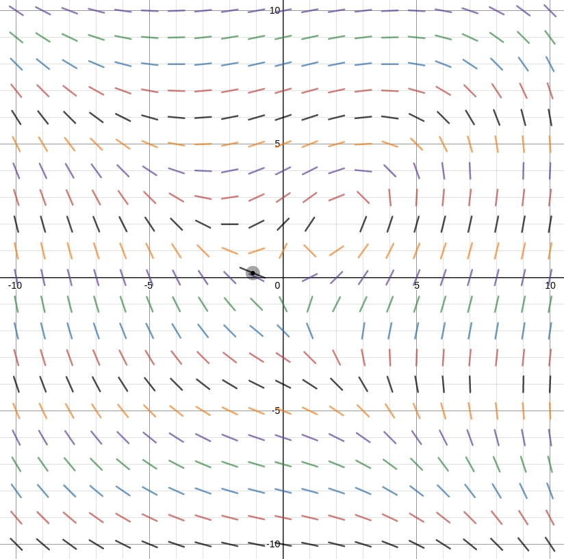

## Chain Rule 2

if: $z = f(x,y)$, $x = g(s,t)$, $y = h(s,t)$

Question: what are $\delta z\over \delta s$, $\delta z\over \delta t$?  
Answer:
$${\delta z\over \delta s} = {\delta z\over \delta x} * {\delta x\over \delta s} + {\delta z\over \delta y} * {\delta y\over \delta s}$$

  
Click to show Example 3

### Question 3

$z = e^x\sin(y)$, where $x = st^2$, $y = s^2t$. Find $\delta z\over \delta s$

#### Solution

$${\delta z\over \delta s} = {\delta z\over \delta x} * {\delta x\over \delta s} + {\delta z\over \delta y} * {\delta y\over \delta s}$$

$${\delta z\over \delta s} = e^x\sin(y) * t^2 + e^x\cos(y) * 2st$$

This is not desirable because it depends on 4 variables, so plug $st^2$ and $s^2t$ for $x$ and $y$

$${\delta z\over \delta s} = e^{st^2}\sin(s^2t) * t^2 + e^{st^2}\cos(s^2t) * 2st$$

## Implicit Differentiation

Implicit functions are not solve for one variable. This is useful because we can use functions that have not been solved or cannot be solved for $y$.

### Example

Let $y$ be given as a function depending on $x$ implicitly by $F(x,y) = 0$.
Find $dy\over dx$.

If we denote $x =t$, $y=h(x)=h(t)$
Then, $g(t) = F(t,h(t)) = 0$
By Chain Rule 1,
$${dg\over dt} = {\delta F\over \delta x} * {dx\over dt} + {\delta F\over \delta y}*{dy\over dt} = 0$$
$${dy\over dt} = {dy\over dx} = -{{\delta F\over \delta x}\over{\delta F\over \delta y}} = - {Fx\over Fy}$$
$$(Fy \ne 0)$$

  
Click to show Example 8 (14.5)

### Question

Given $x^3 + y^3 = 6xy$, Find $dy\over dx$

#### Solution

$$F(x,y) = 0 = x^3 + y^3 - 6xy$$
Therefore, from the above formula:
$${dy\over dx} - {Fx\over Fy} = - {3x^2 - 6y\over 3y^2-6x} = - {x^2 - 2y\over y^2-2x}$$

#### How it is used

Essentially, this is a representation of a slope field, related to differential equations.

Assume we want to find ${dy\over dx}$ at the point$(0,0)$
$${dy\over dx}= G(x,y) = - {x^2 - 2y\over y^2-2x}$$
So, at this point, the derivative does not exist.

Find the value if $x = 1$, $1 + y^3 = 6y$.

There exists a formula to find y from this equation, so you can plug that in.

## Directional Derivatives

Given a surface, we can define an arbitrary direction and find the derivative of the surface in that direction. That will represent the rate of change in the surface in that direction.

### Definition

Given the function $z = f(x,y)$, and its partial derivatives $f_x(x_0,y_0$, $f_y(x_0,y_0)$. Let the directional vector $u = \langle a,b\rangle$ such that $\sqrt{a^2 + b^2} = 1$ (it has a length of 1)

$$D_uf(x_0,y_0) = \lim\limits_{h\to 0}{f(x_0 + ha, y_0 + hb) - f(x_0,y_0)\over h}$$
This is showing the limit as a point displaced from $(x_0,y_0)$ by $h$ amount along the vector $u$, or $\langle a,b\rangle$,

<link rel="stylesheet" href="/source/theme.css">
